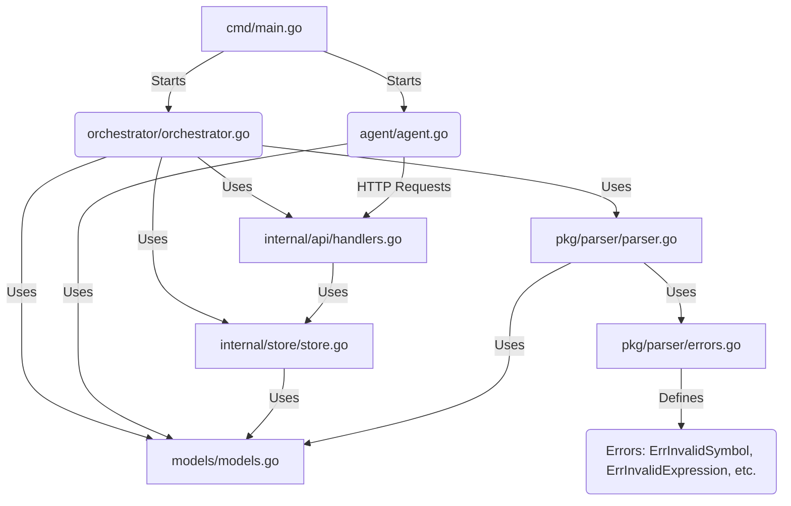
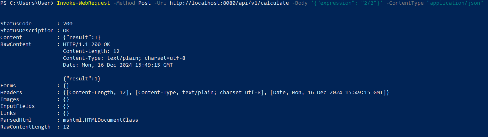
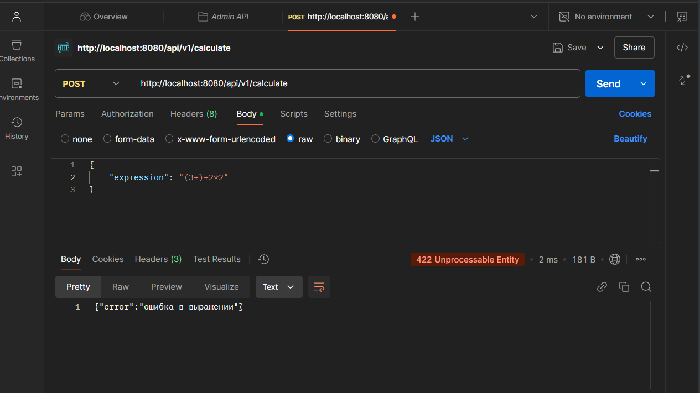
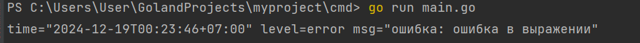
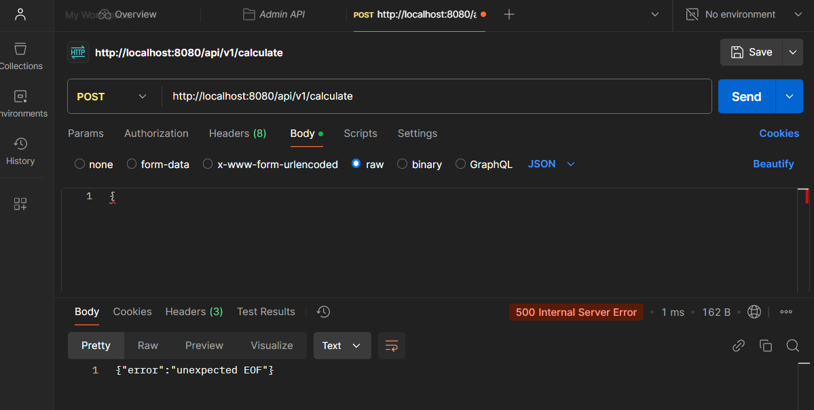
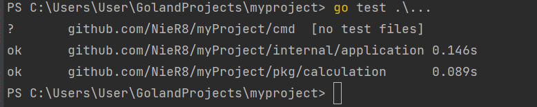

# Калькулятор на Go

## Как запустить программу:
#### Объяснение схемы
- **`cmd/main.go`**: Точка входа, запускает оркестратор и агента.
- **`orchestrator/orchestrator.go`**: Центральный узел, использует API, хранилище, парсер и модели.
- **`agent/agent.go`**: Исполнители задач, взаимодействуют с оркестратором через API.
- **`internal/api/handlers.go`**: Обрабатывает запросы агентов.
- **`internal/store/store.go`**: Хранит задачи и выражения.
- **`pkg/parser/parser.go`**: Парсит выражения, зависит от `errors.go` и моделей.
- **`pkg/parser/errors.go`**: Определяет ошибки парсинга.
- **`models/models.go`**: Общие структуры данных.

---

A distributed system for evaluating mathematical expressions with an orchestrator and agents.

## Как сформировать POST-запрос:
[agent.go](agent%2Fagent.go)
1) Если вы используете macOS, для отправки запроса в терминале введите команду:  
`curl --location 'http://localhost:PORT/api/v1/calculate' \
   --header 'Content-Type: application/json' \
   --data '{
   "expression": "2+2"
   }'`,  
где `{ "expression": "2+2"}` - пример математического выражения для калькулятора.
2) Если вы используете Windows OC, то в терминале PowerShell команда для вас:  
`Invoke-WebRequest -Method Post -Uri http://localhost:PORT/api/v1/calculate -Body '{"expression": "2/2"}' -ContentType "application/json"`  
Пример результата запроса:

3) Также запрос можно отправить с помощью Postman. Для этого в новом запросе выберите метод `POST`, введите адрес, по которому нужно отправить запрос и во вкладке `Body` -> `raw` введите выражение.  
Пример выполнения:

Ответ к вашему выражению будет отображен в отдельной вкладке `Body`, также лог ответ отобразится в консоли.

## Информация по доступным значения в математических выражениях

1) В программе допустимо ввод числа с плавающей точкой подобным образом: `.4 = 0.4` или `4. = 4.0`. Нельзя использовать знак `,` в таких чилсах, только `.`: `3.0 + 0.3` - правильно, `3,0 + 0,3` - программа выдаст ошибку.
2) В программе допустимо вычисления с отрицательными числами, но если вы хотите вычислить такое выражение, оберните отрицательные числа в скобки (если это отрицательное число не стоит вначале выражения) по примеру: `-2/(-2), -2-(-2), -2*(-2), -2-(+2)`.
3) Если вы отправите пустое `Body`, либо обратитесь по эндпоинту c любым другим запросом кроме POST, то программа выдаст ошибку с кодом 500.  
  
В программе есть тесты, для их запуска в корне проекта введите команду `go test .\...`. В результате должно отобразиться подобное сообщение:  

Таблица со статусами для сводки

| Статус   | Тело запроса                                                                                                           | Ответ |
|----------|------------------------------------------------------------------------------------------------------------------------|-|
| 200 (ОК) | `Invoke-WebRequest -Method Post -Uri http://localhost:PORT/api/v1/calculate -Body '{"expression": "2/2"}' -ContentType "application/json"` | `{"result":"1.000"}` |
| 422      | `Invoke-WebRequest -Method Post -Uri http://localhost:PORT/api/v1/calculate -Body '{"expression": "2/0"}' -ContentType "application/json"` | `{"error":"деление на 0"}`|
| 500      | `Invoke-WebRequest -Method Post -Uri http://localhost:PORT/api/v1/calculate -Body '{' -ContentType "application/json"` |`{"error":"unexpected EOF"}` |
