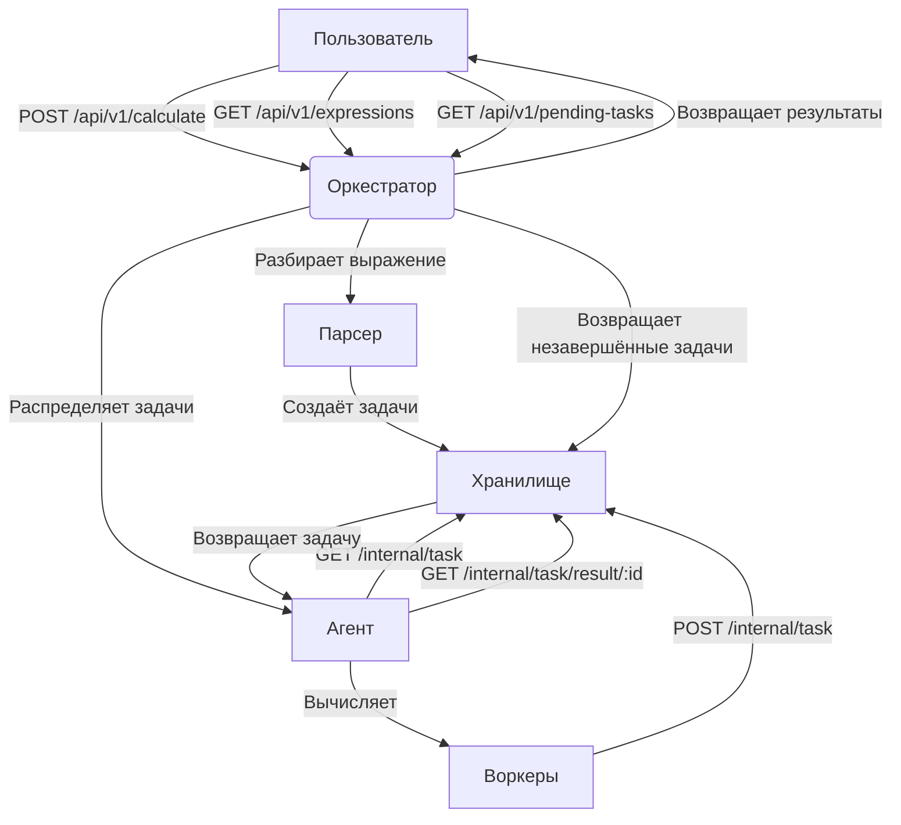
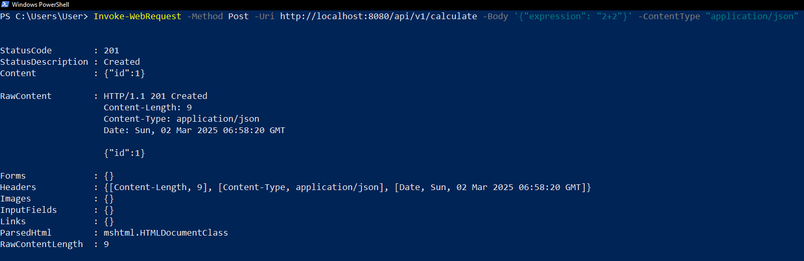
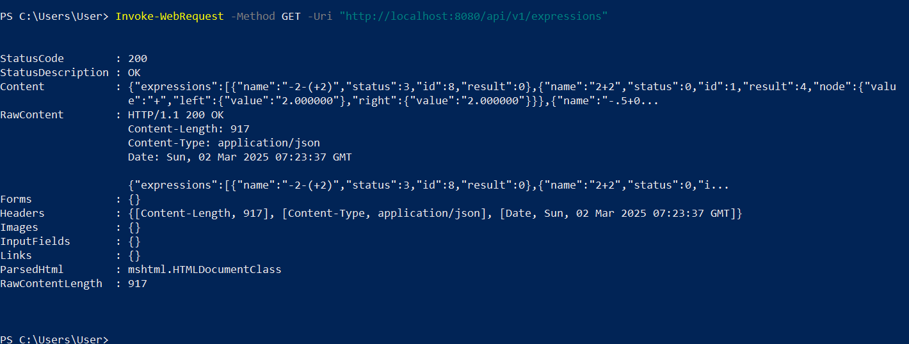
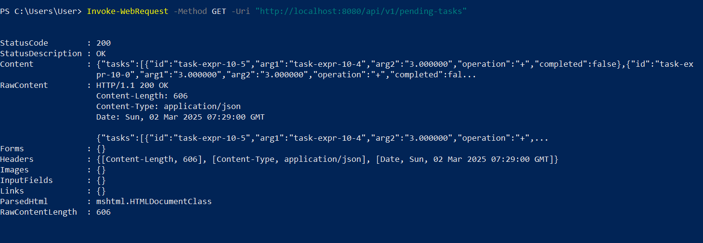

# Калькулятор на Go
Распределённая система для вычисления математических выражений с использованием оркестратора и агентов. Оркестратор разбирает выражения, распределяет задачи между агентами, а агенты вычисляют результаты параллельно.

## Особенности
- **Распределённые вычисления**: Выражения разбиваются на задачи и обрабатываются несколькими агентами.
- **Обработка ошибок**: Обнаруживает ошибки, такие как деление на ноль, на этапе разбора.
- **Настраиваемость**: Количество воркеров и время операций задаются через переменные окружения.
- **API-ориентированность**: REST API для отправки выражений и получения результатов.

## Структура проекта

```
├── cmd/
│   └── main.go        # Точка входа, запускает оркестратор и агента
├── internal/
│   ├── api/           # Обработчики внутреннего API для управления задачами
│   │   └── handlers.go
│   ├── store/         # Хранилище задач и выражений
│   │   └── store.go
│   └── env/           # Загрузка конфигурации (переменные окружения)
│       └── env.go
├── agent/             # Логика агента (воркеры, вычисление задач)
│   └── agent.go
├── orchestrator/      # Логика оркестратора (API, управление задачами)
│   └── orchestrator.go
├── pkg/
│   └── parser/        # Логика разбора выражений
│       ├── parser.go  # InfixToRPN, ParseRPN, BuildTasks
│       └── errors.go  # Ошибки парсинга
└── models/            # Структуры данных (Task, Expression, Node, Result)
│     └── models.go
└── pics               # Различные медиа для Readme
```
#### Объяснение схемы
- **`cmd/main.go`**: Точка входа, запускает оркестратор и агента.
- **`orchestrator/orchestrator.go`**: Центральный узел, использует API, хранилище, парсер и модели.
- **`agent/agent.go`**: Исполнители задач, взаимодействуют с оркестратором через API.
- **`internal/api/handlers.go`**: Обрабатывает запросы агентов.
- **`internal/store/store.go`**: Хранит задачи и выражения.
- **`pkg/parser/parser.go`**: Парсит выражения.
- **`models/models.go`**: Общие структуры данных.
---


### Схема архитектуры



- Пользователь: Отправляет выражения и получает результаты через API.
- Оркестратор: Управляет процессом, обслуживает API-эндпоинты.
- Парсер: Преобразует выражения в задачи.
- Хранилище: Содержит задачи и выражения, управляет очередью задач для агентов.
- Агент: Выполняет задачи с помощью пула воркеров.

## Текущие эндпоинты оркестратора
### Публичные эндпоинты (для пользователей):
- `POST /api/v1/calculate` — Отправка выражения для вычисления.
- `GET /api/v1/expressions` — Получение списка всех выражений.
- `GET /api/v1/expressions/:id` — Получение конкретного выражения по ID.
- `GET /api/v1/pending-tasks` — Просмотр незавершённых задач.
### Внутренние эндпоинты (для агентов):
- `GET /internal/task` — Получение задачи для выполнения агентом.
- `POST /internal/task` — Отправка результата выполненной задачи.


## Как это работает
### Отправка выражения:
- Пользователь отправляет выражение `(например, "2+2")` на `/api/v1/calculate`.
- Оркестратор преобразует его в обратную польскую нотацию (RPN) и строит дерево задач.
- Задачи сохраняются и помещаются в очередь для агентов.
### Распределение задач:
- Агенты запрашивают задачи через `/internal/task`.
- Хранилище выдаёт задачи, когда они готовы (зависимости выполнены).
### Вычисление:
- Агенты вычисляют задачи `(например, 2+2=4)` и отправляют результаты через `/internal/task`.
- Для задач с зависимостями агенты запрашивают результаты через `/internal/task/result/:id`.
### Получение результатов:
- Пользователь запрашивает `/api/v1/expressions` для просмотра всех выражений и их статуса.
- Статусы: `0 (выполнено), 1 (в процессе), 2 (в ожидании), 3 (ошибка)`.
### Мониторинг незавершённых задач:
- `/api/v1/pending-tasks` возвращает список задач, которые ещё не выполнены.

## Как запустить программу:
1) Склонируйте репозиторий: 
```
git clone git@github.com:NieR8/GO_calculator.git
```
2) Запустите командой в корне проекта:
```
go run cmd/main.go
```

## Конфигурация
Установите переменные окружения для настройки системы:

- `COMPUTING_POWER`: Количество воркеров (по умолчанию: 3).
- `TIME_ADDITION_MS`: Время сложения в мс (по умолчанию: 200).
- `TIME_SUBTRACTION_MS`: Время вычитания в мс (по умолчанию: 150).
- `TIME_MULTIPLICATION_MS`: Время умножения в мс (по умолчанию: 100).
- `TIME_DIVISION_MS`: Время деления в мс (по умолчанию: 250).
- `ORCHESTRATOR_ADDR`: Адрес оркестратора (по умолчанию: 8080).

Пример для macOS:
```
export COMPUTING_POWER=5
export TIME_ADDITION_MS=300
export ORCHESTRATOR_ADDR=":8080"
```
Пример для Windows OS:
```
$env:COMPUTING_POWER=5
$env:TIME_ADDITION_MS=300
$env:ORCHESTRATOR_ADDR=":8080"
```

## Как сформировать POST-запрос:
### Отправка выражения
- Если вы используете macOS для отправки запроса, в терминале введите команду:  
```
   curl --location 'http://localhost:8080/api/v1/calculate' \
   --header 'Content-Type: application/json' \
   --data '{
   "expression": "2+2"
   }'
```     
где `{ "expression": "2+2"}` - пример математического выражения для калькулятора. 
- Если вы используете Windows OS, то в терминале PowerShell команда для вас:  
```
Invoke-WebRequest -Method Post -Uri http://localhost:8080/api/v1/calculate -Body '{"expression": "2+2"}' -ContentType "application/json"
```  
Пример ответа:


- Также запрос можно отправить с помощью Postman. Для этого в новом запросе выберите метод `POST`, введите адрес, по которому нужно отправить запрос и во вкладке `Body` -> `raw` введите выражение. 

### Получение выражений и данных
#### Получение всех выражений
Для macOS:
```
curl "http://localhost:8080/api/v1/expressions"
```
Для Windows OS:
```
Invoke-WebRequest -Method GET -Uri "http://localhost:8080/api/v1/expressions"
```
Пример ответа:


#### Получение выражения по id
Для macOS:
```
curl "http://localhost:8080/api/v1/expressions/1"
```
Для Windows OS:
```
Invoke-WebRequest -Method GET -Uri "http://localhost:8080/api/v1/expressions/1"
```
#### Получение незавершенных задач
Для macOS:
```
curl "http://localhost:8080/api/v1/pending-tasks"
```
Для Windows OS:
```
Invoke-WebRequest -Method GET -Uri "http://localhost:8080/api/v1/pending-tasks"
```
Пример ответа:

## Дополнительная информация

1) В программе допустимо ввод числа с плавающей точкой подобным образом: `.4 = 0.4` или `4. = 4.0`. Нельзя использовать знак `,` в таких чилсах, только `.`: `3.0 + 0.3` - правильно, `3,0 + 0,3` - программа выдаст ошибку.
2) В программе допустимо вычисления с отрицательными числами, но если вы хотите вычислить такое выражение, оберните отрицательные числа в скобки (если это отрицательное число не стоит вначале выражения) по примеру: `-2/(-2), -2-(-2), -2*(-2)`.
3) В программе есть тесты, для их запуска в корне проекта введите команду `go test .\...`. 
4) Пока без веб-интерфейса


Таблица со статусами для сводки

| Статус         | Тело запроса                                                                                                                               | Ответ                  |
|----------------|--------------------------------------------------------------------------------------------------------------------------------------------|------------------------|
| 201 (Created)  | `Invoke-WebRequest -Method Post -Uri http://localhost:8080/api/v1/calculate -Body '{"expression": "2/2"}' -ContentType "application/json"` | `{"id":"1"}`           |
| 422            | `Invoke-WebRequest -Method Post -Uri http://localhost:8080/api/v1/calculate -Body '{"expression": "2/0"}' -ContentType "application/json"` | `division by zero`     |
| 404            | `Invoke-WebRequest -Method GET -Uri "http://localhost:8080/api/v1/expressions/444"`                                                        | `Expression not found` |
| 200 (OK)       | `Invoke-WebRequest -Method GET -Uri "http://localhost:8080/api/v1/pending-tasks"`                                                          | `{"tasks": null}`      |
| 500            | `Invoke-WebRequest -Method Post -Uri http://localhost:8080/api/v1/calculate -Body '{' -ContentType "application/json"`                     | `Invalid request`      |